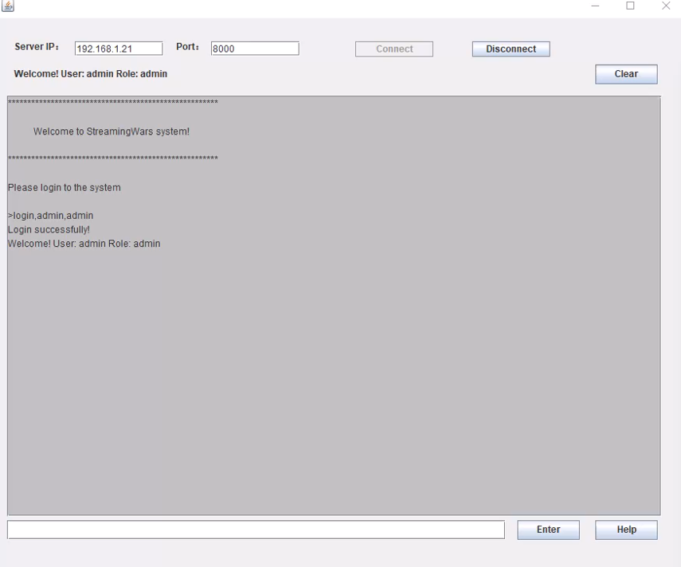
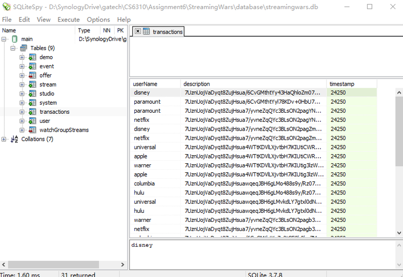

# Streaming Service System Development

**Authors:**

**Team 58: Wenyan Du, Qian Liu, Tianfang Xie, Yu Zhang, Pengcheng Zhou**

## 1 Introduction

In this project, we developed a network based system using Java/Socket that allows users to track offerings from various streaming services. UML diagrams were utilized to portray the behavior and structure of the streaming service system. A server program was implemented to start a Socket network service and maintain user data in a SQL database. A client program was developed for the users to register/log in to the system and execute their commands.

## 2 Code Compile

The applications were compiled and packed in executable JAR files. They are composed of two parts, the server and the client. The detailed instructions for running the application are as follows.

(1) Run server

The following files are required in the directory where server.jar is located:
lib/sqlite-jdbc-3.34.0.jar (it provides support for SQL database)
server.config (it provides the port and encryptionkey)

The server can be run in a command line interface with following command:
java -jar server.jar
The database folder will be created automatically. If you want to empty the database, delete the database folder and restart the server.

(2) Run client

The following file is required in the directory where client.jar is located:
client.config (it provides the server ip and port)

The client can be run in a command line interface with following command:
java -jar client.jar
If the required JAVA environment is set up, you can run it by double-clicking the JAR file.

(3) Compiling

The existing JAR files were compiled and packed using JDK 16. They can be recompiled by run makejar.bat(Windows) or makejar.sh(Linux) in the source code folder. The JAR file will be automatically generated.

## 3 Graphic User Interface

The Graphic User Interface (GUI) allows the user to connect the server using the entered IP address and port.

After login, the user can execute the authorized commands.

User data was stored in the SQL database. For privacy purpose, the private data is encrypted before being saved in the database.
